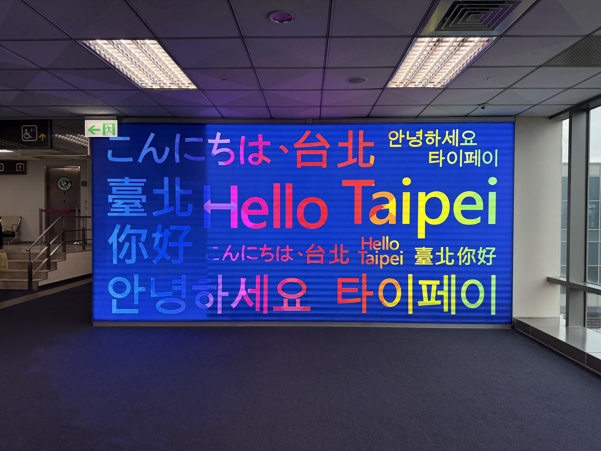
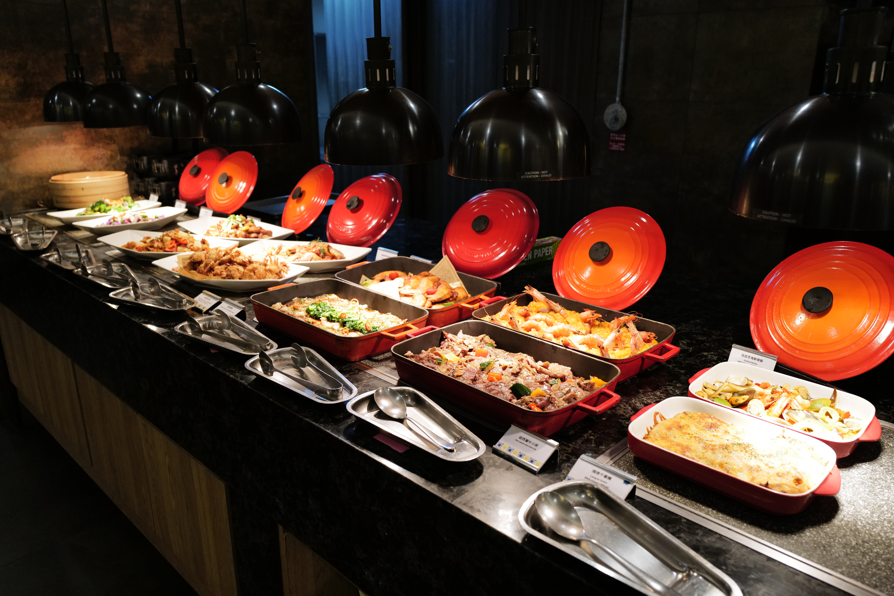
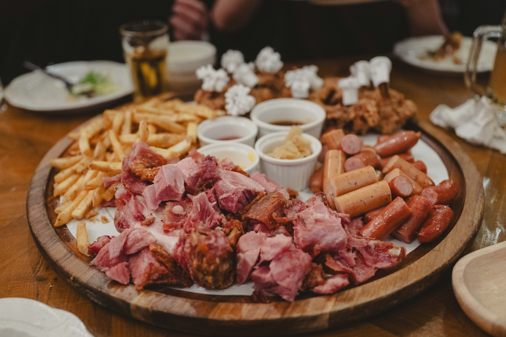
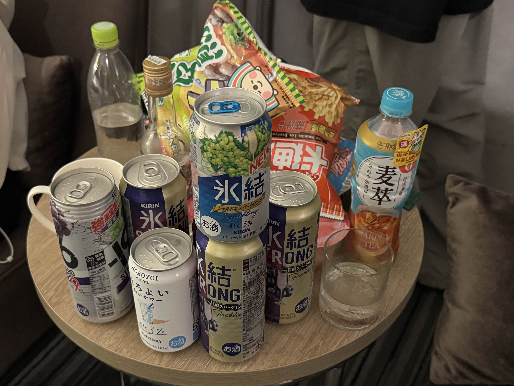

+++
title = "GCC 2025 Taiwan 体験記"
date = 2025-03-01T23:00:00+09:00
tags = ['体験記']
+++

## GCC 2025 Taiwan参加
「GCC 2025 Taiwan」というイベントに参加しました。
GCC 2025 TaiwanはGlobal Cybersecurity Camp 2025 Taiwanの略で、「国籍・人種を超えた専門知識のあるグローバル人材の育成」と「国境を超えた友情とゆるやかなコミュニティの形成」を目的としたイベントです。日本、シンガポール、韓国、台湾、タイ、ベトナム、マレーシア、インドネシア、インド、ルーマニアの10カ国が参加し、各国から数名の学生が参加するイベントです。
今回選考に通ったので、参加させていただくことになりました！
イベントの詳細なスケジュールや、講義の内容などは以下のサイト等を参考にしてください。
- [GCC](https://gcc.ac/)
- [Security Camp Committee](https://www.security-camp.or.jp/event/gcc_taiwan2025.html)

ここではGCCに参加し、印象に残っていることと、学んだことを紹介します。

### 初めての海外

GCCで台湾に行くのが、私にとって初海外でした。飛行機が台湾に着陸し、検査場を通った時は、とてもワクワクしました。事前に契約していたeSIMが正しく認識するのに手間取り少し焦りました（笑）

一日目は、アイスブレイクパーティーがありました。様々な国の受講生と話をしました。私は英語が苦手なので、なかなか聞くことも伝えることも時間がかかりましたが、日本のアニメや歌手、アイドルなどの話で盛り上がりました。受講生の多くがCTF好きで、流石だなと感じました。

### 印象に残った講義
二日目以降は朝から夜までセキュリティの講義がありました。サニタイジングとC++のバイナリ解析の講義が特に面白かったです。私はCコンパイラを自作したことがあり、サニタイジングのことについても少し聞いたことがありました。しかしサニタイジングを実装することまではしたことがありませんでした。講義では簡単なサニタイジングをコンパイラに実装するというもので、やりがいがありました。グループのメンバーからもDiscordで質問されて、答えられたのも良い思い出です。

カーネルエクスプロイトの講義は、難しすぎてほとんど理解することができませんでした。基礎の基礎から勉強する必要があるなと感じました。勉強するためのサイトなどを教えてもらったので、コツコツと進めていきたいです。

### グループワーク
講義の他にグループワークもありました。私たちのグループは台湾、韓国、インド、タイ、ベトナムの方で構成されていました。グループワークでは各グループに課題が割り当てられ、最終日にその課題をクリアして発表するという内容でした。私たちの課題はSSOのロガーの実装でした。

講義は夜まであったので、グループワークはその後グループメンバーのホテルの部屋で行いました。毎晩夜の3時ごろまで取り組み、何とか最終日までに実装を終えました。グループのメンバーはとても仕事が早く、私がSSOの仕様を調べている間におよそのUIを作ってくれていました。私はSSOで使われるプロトコルの仕様を調べるのと、実装部分の修正、プレゼンで使用する資料の作成を手伝いました。グループメンバーの方がとても親切で、英語が得意ではない私のために、Discordでやり取りをしてくれたり、ご飯にも誘ってくれたり、色々と気遣ってくれました。皆と協力して課題に取り組めたのはとても楽しかったです。

グループとしては「EXAM VOUCHER」という権利をいただきました。まさか選ばれると思っていなかったので、グループのメンバーもとても驚いていました。

### 海外のノリ
最終日には半日の観光とクロージングパーティーがありました。カラオケが行われ、大変盛り上がりました。音楽が流れれば、手拍子や、ダンス、掛け声などがかかり、海外のノリを肌で感じることができる非常に良い経験になりました。

### 英語は楽しむためのツールである
GCC全体として学んだことは、英語で自分の言いたいことを伝えられた時の「楽しさ」です。私は英語が下手ですが、ジェスチャーを使ったり、例をたくさん挙げたりして、自分の言葉で伝えられた時はうれしさと楽しさでいっぱいでした。

海外の方はとても優しく、GCCを十分楽しむことができました。しかし、もっと英語が使えれば、ジョークを言ったり、海外のノリに加われたり、講義をより理解できたりして、もっともっと楽しむことができるのになあという場面に何度も出会いました。今回の一番の学びは「**英語は楽しむためのツールである**」ということに気づけたことです。今後、より楽しむために英語を学びたいと思います！！

### 感謝
GCCに参加し、無事に日本に帰国できたのは日本人スタッフの方や、日本チームのサポートスタッフの方、日本チームの受講生の方、グループワークのメンバーの方など、全てのGCCに関わる皆さんのおかげです。大変貴重な経験をすることができました。ありがとうございました！

またどこかで会いましょう！  
You can meet me **for free~~~~~~~~~~~~~~!!!**

